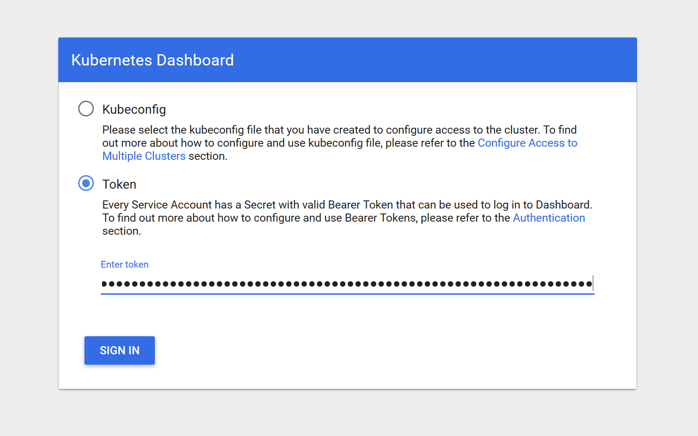
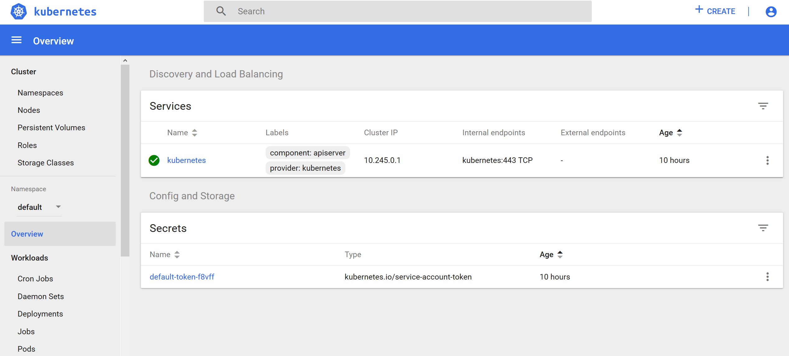

# K8S Bits n Bytes

## Voorbereiding

### Software

- Installeer [kubectl](https://kubernetes.io/docs/tasks/tools/install-kubectl/)
- Installeer een text editor met YAML (of JSON) ondersteuning, bijvoorbeeld [Visual Studio Code](https://code.visualstudio.com/)

### kubectl configuratie

Kopieer van de USB stick de bestanden `config` en `token` naar `~/.kube` (bijvoorbeeld naar `C:\Users\ninckblokje\.kube`). Controleer de configuratie door het volgende commando uit te voeren:

````
$ kubectl get nodes
NAME                                        STATUS   ROLES    AGE   VERSION
k8s-1-13-5-do-1-ams3-1554623941376-1-7vyg   Ready    <none>   11h   v1.13.5
````

### Dashboard

Om verbinding te maken met het Dashboard moet het volgende commando gebruikt worden (deze blijft altijd open):

````
$ kubectl proxy
Starting to serve on 127.0.0.1:8001
````

De gehele K8S API is nu beschikbaar via http://localhost:8001. Het Dashboard kan bereikt worden via: http://localhost:8001/api/v1/namespaces/kube-system/services/https:kubernetes-dashboard:/proxy/#!/overview?namespace=default

De eerste keer moet een token worden ingevoerd. Gebruik hiervoor de inhoud van het bestand token.





### Notes

- Alle configuratie is in YAML formaat, maar zelf JSON opstellen is ook mogelijk
- Voorbeelden zijn met de namespace `ninckblokje` vervang deze door je eigen namespace

## Slides

## Opdrachten

- [Opdracht 1: Namespace aanmaken](opdr1/opdracht1.md)
- [Opdracht 2: Pod deployen](opdr2/opdracht2.md)
- [Opdracht 3: Pod ontsluiting](opdr3/opdracht3.md)
- [Opdracht 4: Deployment](opdr4/opdracht4.md)
- [Opdracht 5: Configuratie](opdr5/opdracht5.md)
- [Opdracht 6: Probes](opdr6/opdracht6.md)
- [Opdracht 7: Opslag](opdr7/opdracht7.md)
- [Opdracht 8: Ingress](opdr8/opdracht8.md)
- [Opdracht 9: Jobs](opdr9/opdracht9.md)
- [Opdracht 10: Resources](opdr10/opdracht10.md)
- [Opdracht 11: RBAC](opdr11/opdracht11.md)
- [Opdracht 12: K8S API mogelijkheden](opdr12/opdracht12.md)

- Opdracht 11: Debugging pods (15 minuten)
- Opdracht 12: Developing in K8S (15 minuten)
- Opdracht 13: Build your own pod (30 minuten)

- Opdracht 15: Kubernetes API (10 minuten)
- Opdracht 16: Kustomize (10 minuten)
- Opdracht 17: Helm (10 minuten)
- Opdracht 18: Build your own chart (30 minuten)